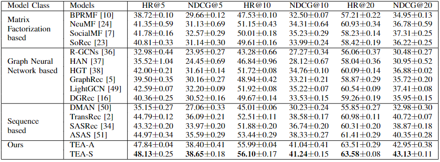
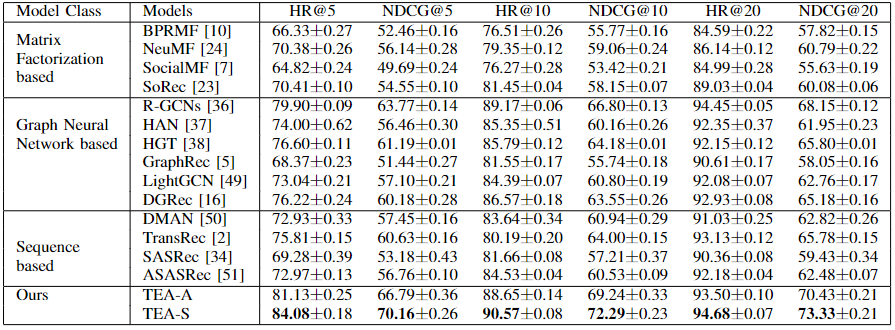

# TEA: A Sequential Recommendation Framework via Temporally Evolving Aggregations
This implementation of TEA is based on Pytorch. 

## Quick Start  
The experiment uses the Yelp and Epinions data sets. Data preprocessing is required before training.  Here uses yelp as an example
```
python my_preprocess_yelp.py
```
TEA can be trained afterwards  
```
python run_tea_metapath_yelp.py
```
The training method of the baseline in the paper is similar. 

## Experiment Result  
### Epinions  

### Yelp

